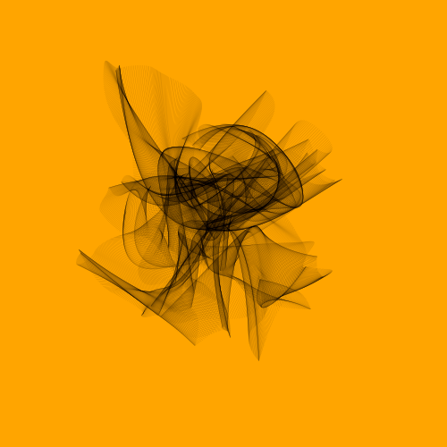
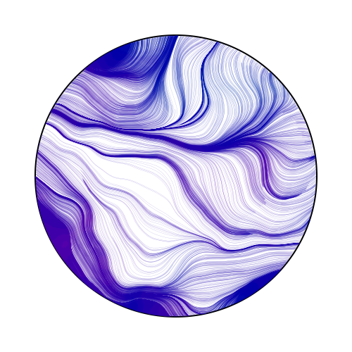

# gena

[](https://github.com/rprtr258/gena/actions/workflows/go.yml)
[](https://goreportcard.com/report/github.com/rprtr258/gena)

`gena` is a `Go` package to create generative art.

## How to use

### Hello, Circle!
```go
package main

import . "github.com/rprtr258/gena"

func main() {
    dc := NewContext(complex(1000, 1000))
    dc.DrawCircle(complex(500, 500), 400)
    dc.SetColor(ColorRGB(0, 0, 0))
    dc.Fill()
    SavePNG("out.png", dc.Image())
}
```

### Creating Contexts

There are a few ways of creating a context.

```go
NewContext(size V2) *Context
NewContextFromRGBA(im *image.RGBA) *Context
```

### Drawing Functions
```go
DrawPoint(pos V2, r float64)
DrawLine(from, to V2)
DrawRectangle(topLeft, size V2)
DrawRoundedRectangle(topLeft, size V2, r float64)
DrawCircle(center V2, r float64)
DrawArc(center V2, r, angle1, angle2 float64)
DrawEllipse(center, r V2)
DrawEllipticalArc(center, r V2, angle1, angle2 float64)
DrawRegularPolygon(n int, center V2, r, rotation float64)
DrawImage(im image.Image, pos V2)
DrawImageAnchored(im image.Image, pos, a V2)
SetPixel(pos V2)

MoveTo(pos V2)
LineTo(pos V2)
QuadraticTo(v1, v2 V2)
CubicTo(v1, v2, v3 V2)
ClearPath()
NewSubPath()
ClosePath()

Clear()
Stroke()
Fill()
StrokePreserve()
FillPreserve()
```

It is often desired to center an image at a point. Use `DrawImageAnchored` with `a` set to `0.5` to do this. Use `0` to left or top align. Use `1` to right or bottom align. `DrawStringAnchored` does the same for text, so you don't need to call `MeasureString` yourself.

### Text Functions
It will even do word wrap for you!

```go
DrawString(s string, v V2)
DrawStringAnchored(s string, v, a V2)
DrawStringWrapped(s string, v, a V2, width, lineSpacing float64, align Align)
MeasureString(s string) V2
MeasureMultilineString(s string, lineSpacing float64) V2
WordWrap(s string, w float64) []string
SetFontFace(fontFace font.Face)
LoadFontFace(path string, points float64) error
```

### Color Functions
```go
ColorRGB(r, g, b float64) color.Color
ColorRGBA(r, g, b, a float64) color.Color
ColorRGB255(r, g, b int) color.Color
ColorRGBA255(r, g, b, a int) color.Color
ColorHex(x string) color.Color
```

### Stroke & Fill Options
```go
SetLineWidth(lineWidth float64)
SetLineCap(lineCap LineCap)
SetLineJoin(lineJoin LineJoin)
SetDash(dashes ...float64)
SetDashOffset(offset float64)
SetFillRule(fillRule FillRule)
```

### Gradients & Patterns
Linear, radial and conic gradients are supported. You can also use surface patterns or implement your own.

```go
// apply patterns
SetFillStyle(pattern Pattern)
SetStrokeStyle(pattern Pattern)

// builtin patterns
PatternSolid(color color.Color) Pattern
PatternGradientLinear(v0, v1 V2) Pattern
PatternGradientRadial(v0 V2, r0 float64, v1 V2, r1 float64) Pattern
PatternGradientConic(c V2, deg float64) Pattern
PatternPatternSurface(im image.Image, op RepeatOp) Pattern
```

### Transformation Functions
```go
Identity()
Translate(v V2)
Scale(v V2)
Rotate(angle float64)
Shear(v V2)
ScaleAbout(s, v V2)
RotateAbout(angle float64, v V2)
ShearAbout(s, v V2)
TransformPoint(v V2) V2
InvertY()
```

It is often desired to rotate or scale about a point that is not the origin. The functions `RotateAbout`, `ScaleAbout`, `ShearAbout` are provided as a convenience.

`InvertY` is provided in case Y should increase from bottom to top vs. The default is top to bottom.

### Clipping Functions
Use clipping regions to restrict drawing operations to an area that you defined using paths.

```go
Clip()
ClipPreserve()
ResetClip()
AsMask() *image.Alpha
SetMask(mask *image.Alpha)
InvertMask()
```

### Helper Functions
```go
Radians(degrees float64) float64
Degrees(radians float64) float64
LoadImage(path string) image.Image
SavePNG(path string, im image.Image)
SaveJPG(path string, im image.Image, quality uint8)
```

## Examples


- [Janus](#janus)
- [Random Shapes](#random-shapes)
- [Color Circle2](#color-circle2)
- [Circle Grid](#circle-grid)
- [Circle Composes Circle](#circle-composes-circle)
- [Pixel Hole](#pixel-hole)
- [Dots Wave](#dots-wave)
- [Contour Line](#contour-line)
- [Noise Line](#noise-line)
- [Dot Line](#dot-line)
- [Ocean Fish](#ocean-fish)
- [Circle Loop](#circle-loop)
- [Domain Warp](#domain-warp)
- [Circle Noise](#circle-noise)
- [Perlin Perls](#perlin-perls)
- [Color Canva](#color-canva)
- [Julia Set](#julia-set)
- [Black Hole](#black-hole)
- [Silk Sky](#silk-sky)
- [Circle Move](#circle-move)
- [Random Circle](#random-circle)

---

- Maze
- Random Circle Trails
- Silk Smoke
- Spiral Square
- Square Grid
- Circle Line
- Circle Loop
- Silk Sky
- Dot Line
- Swirl
- Point Ribbon
- Color Circle
- Circle Loop2

### Yarn


### Janus


### Random Shapes


### Color Circle2


### Circle Grid


### Circle Composes Circle


### Pixel Hole


### Dots Wave


### Contour Line


### Noise Line


### Dot Line


### Ocean Fish


### Circle Loop


### Domain Warp


### Circle Noise


### Perlin Perls


### Color Canva


### Julia Set


### Black Hole


### Silk Sky


### Circle Move


### Random Circle


### Contribution

Thanks for the following sites and repos, I got lots of ideas, inspiration, code, and tricks from them. The list would be very long; sorry for forgetting some of them.

- <https://inconvergent.net/>
- <https://fronkonstin.com/>
- <https://github.com/aschinchon/cyclic-cellular-automata>
- <https://github.com/armdz/ProcessingSketchs>
- <https://github.com/Mr-Slesser/Generative-Art-And-Fractals>
- <https://github.com/cdr6934/Generative-Processing-Experiments>
- <https://github.com/pkd2512/inktober2017>
- <http://blog.dragonlab.de/2015/03/generative-art-week-1>
- <https://editor.p5js.org/kenekk1/sketches/Ly-5XYvKX>
- <http://paulbourke.net/fractals/peterdejong/>
- <https://editor.p5js.org/kenekk1/sketches/O44Dln5oo>
- <https://openprocessing.org/sketch/1071233>
- <https://twitter.com/okazz_>
- <https://openprocessing.org/sketch/738638>
- <https://openprocessing.org/sketch/1102157>
- <https://openprocessing.org/sketch/1071233>
- <https://openprocessing.org/user/139364>
- <https://openprocessing.org/sketch/792407>
- <https://www.iquilezles.org/www/articles/warp/warp.htm>


