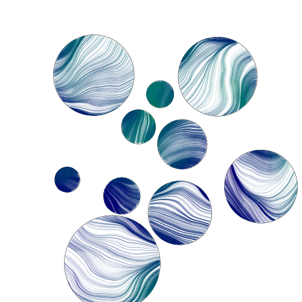

# generativeart

[](https://github.com/rprtr258/gena/actions/workflows/go.yml)
[](https://goreportcard.com/report/github.com/rprtr258/gena)
[](https://raw.githubusercontent.com/jdxyw/generativeart/master/LICENSE)

`generativeart` is a `Go` package to generate many kinds of generative art. The goal is to collect some excellent generative art (implemented in `R` or `Processing`), and rewrite them in `Go` again. I would paste the original link at the end of this README(If I remember, you can also submit a PR if you found I missed something.). Currently, it supports the following type.

# Table of Contents

- [generativeart](#generativeart)
- [Table of Contents](#table-of-contents)
  - [Buy me a coffee](#buy-me-a-coffee)
  - [Contributing](#contributing)
  - [Types supported](#types-supported)
  - [Install](#install)
  - [Art Type](#art-type)
  - [Docs](#docs)
  - [Examples](#examples)
  - [General Options](#general-options)
  - [Usage and example](#usage-and-example)
    - [Junas](#junas)
    - [Random Shapes](#random-shapes)
    - [Color Circle2](#color-circle2)
    - [Circle Grid](#circle-grid)
    - [Circle Composes Circle](#circle-composes-circle)
    - [Pixel Hole](#pixel-hole)
    - [Dots Wave](#dots-wave)
    - [Contour Line](#contour-line)
    - [Noise Line](#noise-line)
    - [Dot Line](#dot-line)
    - [Ocean Fish](#ocean-fish)
    - [Circle Loop](#circle-loop)
    - [Domain Warp](#domain-warp)
    - [Circle Noise](#circle-noise)
    - [Perlin Perls](#perlin-perls)
    - [Color Canva](#color-canva)
    - [Julia Set](#julia-set)
    - [Black Hole](#black-hole)
    - [Silk Sky](#silk-sky)
    - [Circle Move](#circle-move)
    - [Random Circle](#random-circle)
  - [TODO](#todo)
  - [Contribution](#contribution)

## Contributing

I am glad to see someone to contribute to this repo, please follow the [CONTRIBUTING.md](https://github.com/rprtr258/gena/blob/master/CONTRIBUTING.md) for more information. Or you can just open an issue or PR.

## Types supported

This package is still working in progress. More types would be added. Welcome anyone interested in this field to submit your PR.

- Maze
- Julia Set
- Random Circle Trails
- Silk Smoke
- Spiral Square
- Square Grid
- Circle Line
- Circle Loop
- Silk Sky
- Dot Line
- Swirl
- Point Ribbon
- Janus
- Random Shapes
- Color Circle
- Color Circle2
- Circle Grid
- Contour Line
- Noise Line
- Ocean Fish
- Circle Loop2
- Pixel Hole
- Dots Wave
- Circle Move
- Circle Noise
- Yarn
- Black Hole
- Color Canva
- Domain Warp
- Perlin Perls

For these kinds of art, the package provides as many parameters to control the appearance.

## Art Type

```go
NewCircleLine(step float64, lineNum int, radius, xaxis, yaxis float64)
NewCircleLoop(radius float64)
NewMaze(step int)
NewRandCicle(mc, msp int, minStep, maxStep, minr, maxr float64, isRandColor bool)
NewSilkSky(circleNum int, sunRadius float64)
NewSilkSmoke(mc, msp int, minStep, maxStep, minRadius, maxRadius float64, isRandColor bool)
NewSpiralSquare(squareNum int, rectSide, decay float64, randColor bool)
NewSwirl(a, b, c, d, xaxis, yaxis float64)
NewDotLine(n int, ras, canv float64, randColor bool)
NewPointRibbon(r float64)
NewJanus(n int, decay float64)
NewRandomShape(shapeNum int)
NewColorCircle(circleNum int)
NewColorCircle2(circleNum int)
NewCircleGrid(circleNumMin, circleNumMax int)
NewContourLine(lineNum int)
NewNoiseLine(n int)
NewCircleLoop2(depth int)
NewPixelHole(dotN int)
NewDotsWave(dotsN int)
NewCircleMove(circleNum int)
NewCircleNoise(dotsN, colorMin, colorMax int)
NewYarn(n int)
NewBlackHole(circleN int, density, circleGap float64)
NewColorCanve(seg float64)
NewDomainWrap(scale, scale2, xOffset, yOffset float64, cmap ColorMapping)
NewPerlinPerls(circleN, dotsN, colorMin, colorMax int)
```

## Docs

You could find the docs in the [doc](./docs).

## Examples

You could find examples for all types under [example](./example).

## General Options

```go
type Options struct {
 background  color.RGBA
 foreground  color.RGBA
 lineColor   color.RGBA
 lineWidth   float64
 colorSchema []color.RGBA
 nIters      int
 alpha       int
}
```

The `Options` is a global option for the whole `canva`. It includes those general parameters used by different kinds of types, such as `background`, `lineColor`, and `colorScheme`.

For those parameters specified for different kinds of art types, they have their own `struct`.

## Usage and example

Below are some selective examples. For more examples, you could check the example folder.

### Junas

```go
func main() {
 rand.Seed(time.Now().Unix())
 c := generativeart.NewCanva(500, 500)
 c.SetBackground(Black)
 c.FillBackground()
 c.SetColorSchema(DarkRed)
 c.SetForeground(LightPink)
 c.Draw(arts.NewJanus(10, 0.2))
 c.ToPNG("janus.png")
}
```


### Random Shapes

```go
func main() {
 rand.Seed(time.Now().Unix())
 c := generativeart.NewCanva(500, 500)
 c.SetBackground(White)
 c.FillBackground()
 c.SetColorSchema([]color.RGBA{
  {0xCF, 0x2B, 0x34, 0xFF},
  {0xF0, 0x8F, 0x46, 0xFF},
  {0xF0, 0xC1, 0x29, 0xFF},
  {0x19, 0x6E, 0x94, 0xFF},
  {0x35, 0x3A, 0x57, 0xFF},
 })
 c.Draw(arts.NewRandomShape(150))
 c.ToPNG("randomshape.png")
}
```


### Color Circle2

```go
func main() {
 rand.Seed(time.Now().Unix())
 colors := []color.RGBA{
  {0x11, 0x60, 0xC6, 0xFF},
  {0xFD, 0xD9, 0x00, 0xFF},
  {0xF5, 0xB4, 0xF8, 0xFF},
  {0xEF, 0x13, 0x55, 0xFF},
  {0xF4, 0x9F, 0x0A, 0xFF},
 }
 c := generativeart.NewCanva(800, 800)
 c.SetBackground(White)
 c.FillBackground()
 c.SetColorSchema(colors)
 c.Draw(arts.NewColorCircle2(30))
 c.ToPNG("colorcircle2.png")
}
```


### Circle Grid

```go
func main() {
 rand.Seed(time.Now().Unix())
 colors := []color.RGBA{
  {0xED, 0x34, 0x41, 0xFF},
  {0xFF, 0xD6, 0x30, 0xFF},
  {0x32, 0x9F, 0xE3, 0xFF},
  {0x15, 0x42, 0x96, 0xFF},
  {0x00, 0x00, 0x00, 0xFF},
  {0xFF, 0xFF, 0xFF, 0xFF},
 }
 c := generativeart.NewCanva(500, 500)
 c.SetBackground(color.RGBA{0xDF, 0xEB, 0xF5, 0xFF})
 c.FillBackground()
 c.SetColorSchema(colors)
 c.SetLineWidth(2.0)
 c.Draw(arts.NewCircleGrid(4, 6))
 c.ToPNG("circlegrid.png")
}
```


### Circle Composes Circle

```go
func main() {
 rand.Seed(time.Now().Unix())
 colors := []color.RGBA{
  {0xF9, 0xC8, 0x0E, 0xFF},
  {0xF8, 0x66, 0x24, 0xFF},
  {0xEA, 0x35, 0x46, 0xFF},
  {0x66, 0x2E, 0x9B, 0xFF},
  {0x43, 0xBC, 0xCD, 0xFF},
 }
 c := generativeart.NewCanva(500, 500)
 c.SetBackground(color.RGBA{8, 10, 20, 255})
 c.FillBackground()
 c.SetColorSchema(colors)
 c.Draw(arts.NewCircleLoop2(7))
 c.ToPNG("colorloop2.png")
}
```


### Pixel Hole

```go
func main() {
 rand.Seed(time.Now().Unix())
 colors := []color.RGBA{
  {0xF9, 0xC8, 0x0E, 0xFF},
  {0xF8, 0x66, 0x24, 0xFF},
  {0xEA, 0x35, 0x46, 0xFF},
  {0x66, 0x2E, 0x9B, 0xFF},
  {0x43, 0xBC, 0xCD, 0xFF},
 }
 c := generativeart.NewCanva(800, 800)
 c.SetBackground(Black)
 c.FillBackground()
 c.SetColorSchema(colors)
 c.SetIterations(1200)
 c.Draw(arts.NewPixelHole(60))
 c.ToPNG("pixelhole.png")

}
```


### Dots Wave

```go
func main() {
 rand.Seed(time.Now().Unix())
 colors := []color.RGBA{
  {0xFF, 0xBE, 0x0B, 0xFF},
  {0xFB, 0x56, 0x07, 0xFF},
  {0xFF, 0x00, 0x6E, 0xFF},
  {0x83, 0x38, 0xEC, 0xFF},
  {0x3A, 0x86, 0xFF, 0xFF},
 }
 c := generativeart.NewCanva(500, 500)
 c.SetBackground(Black)
 c.FillBackground()
 c.SetColorSchema(colors)
 c.Draw(arts.NewDotsWave(300))
 c.ToPNG("dotswave.png")
}
```


### Contour Line

```go
func main() {
 rand.Seed(time.Now().Unix())
 colors := []color.RGBA{
  {0x58, 0x18, 0x45, 0xFF},
  {0x90, 0x0C, 0x3F, 0xFF},
  {0xC7, 0x00, 0x39, 0xFF},
  {0xFF, 0x57, 0x33, 0xFF},
  {0xFF, 0xC3, 0x0F, 0xFF},
 }
 c := generativeart.NewCanva(1600, 1600)
 c.SetBackground(color.RGBA{0x1a, 0x06, 0x33, 0xFF})
 c.FillBackground()
 c.SetColorSchema(colors)
 c.Draw(arts.NewContourLine(500))
 c.ToPNG("contourline.png")
}
```


### Noise Line

```go
func main() {
 rand.Seed(time.Now().Unix())
 colors := []color.RGBA{
  {0x06, 0x7B, 0xC2, 0xFF},
  {0x84, 0xBC, 0xDA, 0xFF},
  {0xEC, 0xC3, 0x0B, 0xFF},
  {0xF3, 0x77, 0x48, 0xFF},
  {0xD5, 0x60, 0x62, 0xFF},
 }
 c := generativeart.NewCanva(1000, 1000)
 c.SetBackground(color.RGBA{0xF0, 0xFE, 0xFF, 0xFF})
 c.FillBackground()
 c.SetColorSchema(colors)
 c.Draw(arts.NewNoiseLine(1000))
 c.ToPNG("noiseline.png")
}
```


### Dot Line

```go
func main() {
 rand.Seed(time.Now().Unix())
 c := generativeart.NewCanva(2080, 2080)
 c.SetBackground(color.RGBA{230, 230, 230, 255})
 c.SetLineWidth(10)
 c.SetIterations(15000)
 c.SetColorSchema(Plasma)
 c.FillBackground()
 c.Draw(arts.NewDotLine(100, 20, 50, false))
 c.ToPNG("dotline.png")
}
```


### Ocean Fish

```go
func main() {
 rand.Seed(time.Now().Unix())
 colors := []color.RGBA{
  {0xCF, 0x2B, 0x34, 0xFF},
  {0xF0, 0x8F, 0x46, 0xFF},
  {0xF0, 0xC1, 0x29, 0xFF},
  {0x19, 0x6E, 0x94, 0xFF},
  {0x35, 0x3A, 0x57, 0xFF},
 }
 c := generativeart.NewCanva(500, 500)
 c.SetColorSchema(colors)
 c.Draw(arts.NewOceanFish(100, 8))
 c.ToPNG("oceanfish.png")
}
```


### Circle Loop

```go
func main() {
 rand.Seed(time.Now().Unix())
 c := generativeart.NewCanva(500, 500)
 c.SetBackground(Black)
 c.SetLineWidth(1)
 c.SetLineColor(Orange)
 c.SetAlpha(30)
 c.SetIterations(1000)
 c.FillBackground()
 c.Draw(arts.NewCircleLoop(100))
 c.ToPNG("circleloop.png")
}
```


### Domain Warp

```go
func cmap(r, m1, m2 float64) color.RGBA {
 rgb := color.RGBA{
  uint8(Constrain(m1*200*r, 0, 255)),
  uint8(Constrain(r*200, 0, 255)),
  uint8(Constrain(m2*255*r, 70, 255)),
  255,
 }
 return rgb
}

func main() {
 rand.Seed(time.Now().Unix())
 c := generativeart.NewCanva(500, 500)
 c.SetBackground(Black)
 c.FillBackground()
 c.Draw(arts.NewDomainWrap(0.01, 4,4, 20, cmap))
 c.ToPNG("domainwarp.png")
}
```


### Circle Noise

```go
func main() {
 rand.Seed(time.Now().Unix())
 c := generativeart.NewCanva(500, 500)
 c.SetBackground(White)
 c.SetAlpha(80)
 c.SetLineWidth(0.3)
 c.FillBackground()
 c.SetIterations(400)
 c.Draw(arts.NewCircleNoise(2000, 60, 80))
 c.ToPNG("circlenoise.png")
}
```


### Perlin Perls

```go
func main() {
 rand.Seed(time.Now().Unix())
 c := generativeart.NewCanva(500, 500)
 c.SetBackground(White)
 c.SetAlpha(120)
 c.SetLineWidth(0.3)
 c.FillBackground()
 c.SetIterations(200)
 c.Draw(arts.NewPerlinPerls(10, 200, 40, 80))
 c.ToPNG("perlinperls.png")
}
```



### Color Canva

```go
func main() {
 rand.Seed(time.Now().Unix())
 colors := []color.RGBA{
  {0xF9, 0xC8, 0x0E, 0xFF},
  {0xF8, 0x66, 0x24, 0xFF},
  {0xEA, 0x35, 0x46, 0xFF},
  {0x66, 0x2E, 0x9B, 0xFF},
  {0x43, 0xBC, 0xCD, 0xFF},
 }
 c := generativeart.NewCanva(500, 500)
 c.SetBackground(Black)
 c.FillBackground()
 c.SetLineWidth(8)
 c.SetColorSchema(colors)
 c.Draw(arts.NewColorCanve(5))
 c.ToPNG("colorcanva.png")
}
```


### Julia Set

```go
func julia1(z complex128) complex128 {
 c := complex(-0.1, 0.651)

 z = z*z + c

 return z
}

func main() {
 rand.Seed(time.Now().Unix())
 c := generativeart.NewCanva(500, 500)
 c.SetIterations(800)
 c.SetColorSchema(Viridis)
 c.FillBackground()
 c.Draw(arts.NewJulia(julia1, 40, 1.5, 1.5))
 c.ToPNG("julia.png")
}
```


### Black Hole

```go
func main() {
 rand.Seed(time.Now().Unix())
 c := generativeart.NewCanva(500, 500)
 c.SetBackground(color.RGBA{R: 30, G: 30, B: 30, A: 255})
 c.FillBackground()
 c.SetLineWidth(1.0)
 c.SetLineColor(Tomato)
 c.Draw(arts.NewBlackHole(200, 400, 0.01))
 c.ToPNG("blackhole.png")
}
```


### Silk Sky

```go
func main() {
 rand.Seed(time.Now().Unix())
 c := generativeart.NewCanva(600, 600)
 c.SetAlpha(10)
 c.Draw(arts.NewSilkSky(15, 5))
 c.ToPNG("silksky.png")
}
```


### Circle Move

```go
func main() {
 rand.Seed(time.Now().Unix())
 c := generativeart.NewCanva(1200, 500)
 c.SetBackground(White)
 c.FillBackground()
 c.Draw(arts.NewCircleMove(1000))
 c.ToPNG("circlemove.png")
}
```


### Random Circle

```go
func main() {
 rand.Seed(time.Now().Unix())
 c := generativeart.NewCanva(500, 500)
 c.SetBackground(MistyRose)
 c.SetLineWidth(1.0)
 c.SetLineColor(color.RGBA{
  R: 122,
  G: 122,
  B: 122,
  A: 30,
 })
 c.SetColorSchema(Plasma)
 c.SetIterations(4)
 c.FillBackground()
 c.Draw(arts.NewRandCicle(30, 80, 0.2, 2, 10, 30, true))
 c.ToPNG("randcircle.png")
}
```


## TODO

- Add more kinds of generative arts or types.

## Contribution

Thanks for the following sites and repos, I got lots of ideas, inspiration, code, and tricks from them. The list would be very long; sorry for forgetting some of them.

- <https://inconvergent.net/>
- <https://fronkonstin.com/>
- <https://github.com/aschinchon/cyclic-cellular-automata>
- <https://github.com/armdz/ProcessingSketchs>
- <https://github.com/Mr-Slesser/Generative-Art-And-Fractals>
- <https://github.com/cdr6934/Generative-Processing-Experiments>
- <https://github.com/pkd2512/inktober2017>
- <http://blog.dragonlab.de/2015/03/generative-art-week-1>
- <https://editor.p5js.org/kenekk1/sketches/Ly-5XYvKX>
- <http://paulbourke.net/fractals/peterdejong/>
- <https://editor.p5js.org/kenekk1/sketches/O44Dln5oo>
- <https://openprocessing.org/sketch/1071233>
- <https://twitter.com/okazz_>
- <https://openprocessing.org/sketch/738638>
- <https://openprocessing.org/sketch/1102157>
- <https://openprocessing.org/sketch/1071233>
- <https://openprocessing.org/user/139364>
- <https://openprocessing.org/sketch/792407>
- <https://www.iquilezles.org/www/articles/warp/warp.htm>

## Hello, Circle!

Look how easy!

```go
package main

import "github.com/rprtr258/gena/gg"

func main() {
    dc := NewContext(1000, 1000)
    dc.DrawCircle(500, 500, 400)
    dc.SetRGB(0, 0, 0)
    dc.Fill()
    dc.SavePNG("out.png")
}
```

## Examples

There are [lots of examples](https://github.com/rprtr258/gena/gg/tree/master/examples) included. They're mostly for testing the code, but they're good for learning, too.


## Creating Contexts

There are a few ways of creating a context.

```go
NewContext(width, height int) *Context
NewContextForImage(im image.Image) *Context
NewContextForRGBA(im *image.RGBA) *Context
```

## Drawing Functions

Ever used a graphics library that didn't have functions for drawing rectangles
or circles? What a pain!

```go
DrawPoint(x, y, r float64)
DrawLine(x1, y1, x2, y2 float64)
DrawRectangle(x, y, w, h float64)
DrawRoundedRectangle(x, y, w, h, r float64)
DrawCircle(x, y, r float64)
DrawArc(x, y, r, angle1, angle2 float64)
DrawEllipse(x, y, rx, ry float64)
DrawEllipticalArc(x, y, rx, ry, angle1, angle2 float64)
DrawRegularPolygon(n int, x, y, r, rotation float64)
DrawImage(im image.Image, x, y int)
DrawImageAnchored(im image.Image, x, y int, ax, ay float64)
SetPixel(x, y int)

MoveTo(x, y float64)
LineTo(x, y float64)
QuadraticTo(x1, y1, x2, y2 float64)
CubicTo(x1, y1, x2, y2, x3, y3 float64)
ClosePath()
ClearPath()
NewSubPath()

Clear()
Stroke()
Fill()
StrokePreserve()
FillPreserve()
```

It is often desired to center an image at a point. Use `DrawImageAnchored` with `ax` and `ay` set to 0.5 to do this. Use 0 to left or top align. Use 1 to right or bottom align. `DrawStringAnchored` does the same for text, so you don't need to call `MeasureString` yourself.

## Text Functions

It will even do word wrap for you!

```go
DrawString(s string, x, y float64)
DrawStringAnchored(s string, x, y, ax, ay float64)
DrawStringWrapped(s string, x, y, ax, ay, width, lineSpacing float64, align Align)
MeasureString(s string) (w, h float64)
MeasureMultilineString(s string, lineSpacing float64) (w, h float64)
WordWrap(s string, w float64) []string
SetFontFace(fontFace font.Face)
LoadFontFace(path string, points float64) error
```

## Color Functions

Colors can be set in several different ways for your convenience.

```go
SetRGB(r, g, b float64)
SetRGBA(r, g, b, a float64)
SetRGB255(r, g, b int)
SetRGBA255(r, g, b, a int)
SetColor(c color.Color)
SetHexColor(x string)
```

## Stroke & Fill Options

```go
SetLineWidth(lineWidth float64)
SetLineCap(lineCap LineCap)
SetLineJoin(lineJoin LineJoin)
SetDash(dashes ...float64)
SetDashOffset(offset float64)
SetFillRule(fillRule FillRule)
```

## Gradients & Patterns

`gg` supports linear, radial and conic gradients and surface patterns. You can also implement your own patterns.

```go
SetFillStyle(pattern Pattern)
SetStrokeStyle(pattern Pattern)
NewSolidPattern(color color.Color)
NewLinearGradient(x0, y0, x1, y1 float64)
NewRadialGradient(x0, y0, r0, x1, y1, r1 float64)
NewConicGradient(cx, cy, deg float64)
NewSurfacePattern(im image.Image, op RepeatOp)
```

## Transformation Functions

```go
Identity()
Translate(x, y float64)
Scale(x, y float64)
Rotate(angle float64)
Shear(x, y float64)
ScaleAbout(sx, sy, x, y float64)
RotateAbout(angle, x, y float64)
ShearAbout(sx, sy, x, y float64)
TransformPoint(x, y float64) (tx, ty float64)
InvertY()
```

It is often desired to rotate or scale about a point that is not the origin. The functions `RotateAbout`, `ScaleAbout`, `ShearAbout` are provided as a convenience.

`InvertY` is provided in case Y should increase from bottom to top vs. the default top to bottom.

## Stack Functions

Save and restore the state of the context. These can be nested.

```go
Push()
Pop()
```

## Clipping Functions

Use clipping regions to restrict drawing operations to an area that you
defined using paths.

```go
Clip()
ClipPreserve()
ResetClip()
AsMask() *image.Alpha
SetMask(mask *image.Alpha)
InvertMask()
```

## Helper Functions

Sometimes you just don't want to write these yourself.

```go
Radians(degrees float64) float64
Degrees(radians float64) float64
LoadImage(path string) (image.Image, error)
LoadPNG(path string) (image.Image, error)
SavePNG(path string, im image.Image) error
```


## Another Example

See the output of this example below.

```go
package main

import "github.com/rprtr258/gena/gg"

func main() {
	const S = 1024
	dc := NewContext(S, S)
	dc.SetRGBA(0, 0, 0, 0.1)
	for i := 0; i < 360; i += 15 {
		dc.Push()
		dc.RotateAbout(Radians(float64(i)), S/2, S/2)
		dc.DrawEllipse(S/2, S/2, S*7/16, S/8)
		dc.Fill()
		dc.Pop()
	}
	dc.SavePNG("out.png")
}
```


# Table of Contents

- [Table of Contents](#table-of-contents)
	- [Color Circle 2](#color-circle-2)
		- [parameters](#parameters)
	- [Dot Line](#dot-line)
		- [parameters](#parameters-1)
	- [Random Shape](#random-shape)
		- [parameters](#parameters-2)
	- [Janus](#janus)
		- [TODO](#todo)
		- [parameters](#parameters-3)
	- [Contour Line](#contour-line)
		- [parameters](#parameters-4)
	- [Silk Sky](#silk-sky)
		- [parameters](#parameters-5)
	- [Julia](#julia)
		- [parameters](#parameters-6)
	- [Noise Line](#noise-line)
		- [parameters](#parameters-7)
	- [Ocean Fish](#ocean-fish)
		- [parameters](#parameters-8)
	- [Circle Loop2](#circle-loop2)
		- [parameters](#parameters-9)
	- [Pixel Hole](#pixel-hole)
		- [parameters](#parameters-10)
	- [Dots Wave](#dots-wave)
		- [parameters](#parameters-11)
	- [Circle Move](#circle-move)
		- [parameters](#parameters-12)
	- [Circle Noise](#circle-noise)
		- [parameters](#parameters-13)
	- [Yarn](#yarn)
		- [parameters](#parameters-14)
	- [Black Hole](#black-hole)
		- [parameters](#parameters-15)
	- [Color Canva](#color-canva)
		- [parameters](#parameters-16)
	- [Domain Warping](#domain-warping)
		- [parameters](#parameters-17)
	- [Perlin Perls](#perlin-perls)
		- [parameters](#parameters-18)

## Color Circle 2

`Color Circle2` is version 2 of `Color Circle`. It still draws the circle and point cloud.

### parameters

- circleNum: The number of the circle in this drawing.

```go
cc := arts.NewColorCircle2(30)
```


## Dot Line

`dot line` would draw images with the short dot and short. The short lines would compose as a big circle.

### parameters

- n: The number of elements in this image.
- ras/canv: Control the appearance of this image.
- randColor: Use the specified color or random colors.

```go
dl := arts.NewDotLine(100, 20, 50, false)
```


## Random Shape

`random shape` would draw images with random shapes. The whole image would rotate with some degree.

### parameters

- shapeNum: It indicates how many shapes you want to draw.

```go
rs := NewRandomShape(150)
```


## Janus

`Janus` would draw an image with multiple circles split at its center with random noise in the horizontal direction.

### TODO

### parameters

## Contour Line

`Contour Line` uses the `perlin noise` to do some flow field.

### parameters

- lineNum: It indicates how many lines.


## Silk Sky

`Silk Sky` would draw an image with multiple circles converge to one point or one circle.

### parameters

- circleNum: The number of the circles in this drawing.
- sunRadius: The radius of the sun. The sun is a point/circle where other circles meet.

```go
silkSky := NewSilkSky(circleNum int, sunRadius float64)
```


## Julia

`Julia` is to draw a `Julia Set`. [Julia Set](https://en.wikipedia.org/wiki/Julia_set) is a math concept. You can define your own formula in this package.

### parameters

- fn: The custom julia set function.
- maxz: The maximum modulus length of a complex number.
- xaxis, yaxis: The range for the X-Y coordination used to mapping the julia set number to the real pixel of the image. These should be positive. It only indicates the first quadrant range.

```go
func julia1(z complex128) complex128 {
 c := complex(-0.1, 0.651)
 z = z*z + c
 return z
}
julia := arts.NewJulia(julia1, 40, 1.5, 1.5)
```


## Noise Line

`Noise Line` draws some random line and circles based on `perlin noise`.

### parameters

- n: The number of random line.

```go
nl := arts.NewNoiseLine(1000)
```


## Ocean Fish

`Ocean Fish` draws an ocean and some fishes in the center.

### parameters

- lineNum: The number of the line used to simulate the ocean wave.
- fishNum: The number of fish.

```go
o := arts.NewOceanFish(100, 8)
```


## Circle Loop2

`Circle loop2` draws a circle composed by colored circles.

### parameters

- depth: Control the number of circles.

```go
cl := arts.NewCircleLoop2(7)
```


## Pixel Hole

`Pixel Hole` draws a hole with colored dots.

### parameters

- dotN: The number of point in each iteration.

```go
ph := arts.NewPixelHole(60)
```


## Dots Wave

### parameters

- dotsN: The number of dots wave in the image.

```go
d := arts.NewDotsWave(300)
```


## Circle Move

### parameters

- circleNum: The number of the circle in the image.

```go
cm := arts.NewCircleMove(1000)
```


## Circle Noise

### parameters

- dotsN: The number of dot.
- colorMin: The minimum color.
- colorMax: The maximum color.


## Yarn

### parameters

- n: The number of the curve.

```go
y := arts.NewYarn(2000)
```


## Black Hole

### parameters

- circleN: The number of the circle.
- density: Control the density of the circle.
- circleGap: Identify the gap between two circles.

```go
b := arts.NewBlackHole(200, 400, 0.01)
```


## Color Canva

### parameters

- seg:

```go
cc := arts.NewColorCanve(5)
```


## Domain Warping

Warping, or domain distortion is a very common technique in computer graphics for generating procedural textures and geometry. It's often used to pinch an object, stretch it, twist it, bend it, make it thicker or apply any deformation you want.

### parameters

- scale: Control the noise generator.
- xOffset: Control the noise generator.
- yOffset: Control the noise generator.
- fn: A function to mapping the `noise` to color.

```go
d := arts.NewDomainWrap(0.01, 4, 8, cmap)
```


## Perlin Perls

### parameters

- circleN: The number of circle on this image.
- dotsN: The number of dots in each circle. 
- colorMin: The minimum color.
- colorMax: The maximum color.

```go
pp := arts.NewPerlinPerls(10, 200, 40, 80
```

